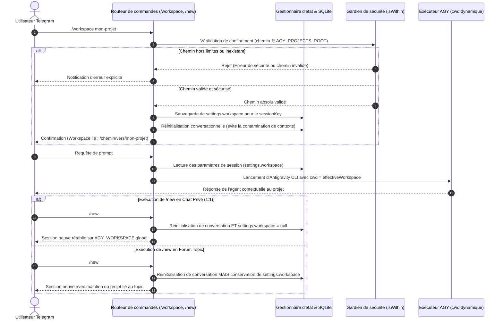

# Spécifications fonctionnelles et techniques : Isolation de workspace par session (/workspace)

> **Projet :** agy-telegram  
> **Statut :** Spécification validée (en cours d'implémentation)  
> **Date de rédaction :** 03/09/2026  
> **Version cible :** v0.5.0  
> **Issue associée :** [#26](https://github.com/ardiannurcahya/antigravity-cli-telegram-bot/issues/26)

---

## 1. Contexte et Objectifs

### Problématique actuelle
Jusqu'à présent, le bot opère avec un répertoire de travail racine unique et statique (`AGY_WORKSPACE`) pour toutes les requêtes de tous les utilisateurs et tous les salons.
Lorsqu'un utilisateur souhaite utiliser le bot pour développer sur un dépôt local spécifique :
1. Les commandes shell exécutées par Antigravity (`git status`, linters, tests) nécessitent de fastidieuses commandes `cd` manuelles à chaque tour.
2. Antigravity CLI ne charge pas nativement les configurations spécifiques au projet (`AGENTS.md`, `.gemini/rules/`, plugins locaux).
3. Les outils de recherche textuelle (`grep_search`, `find_by_name`) balaient tous les répertoires frères ou s'arrêtent au plafond des 50 résultats, générant du bruit et une surconsommation de jetons.

### Objectifs cibles
1. **Isolation granulaire par session** : Permettre d'assigner un répertoire de travail spécifique (`cwd`) à une session Telegram (chat direct 1:1 ou forum topic de supergroupe) via `/workspace <nom|chemin>`.
2. **Modèle mental étanche (Option A)** :
   - En **chat privé (1:1)** : Portée éphémère. Tout `/new` réinitialise le dialogue et rétablit automatiquement le workspace global `AGY_WORKSPACE` afin d'éviter tout verrouillage accidentel lors des tâches de la vie courante.
   - En **forum topic** : Portée persistante. Un fil dédié à un projet conserve sa liaison au répertoire cible même après `/new`.
3. **Sécurité et confinement strict** : Restreindre les chemins sélectionnables aux sous-dossiers autorisés via une racine de projets (`AGY_PROJECTS_ROOT`), avec contrôle strict de non-traversée (`isWithin`).
4. **Zéro régression (100 % opt-in)** : En l'absence d'utilisation explicite de `/workspace`, le bot conserve rigoureusement son comportement par défaut sur `AGY_WORKSPACE`.

---

## 2. Flux fonctionnel détaillé



---

## 3. Modèle de données et Contrats d'interface

### Variables d'environnement (`.env`)

```env
# Répertoire racine autorisé pour la découverte et le confinement des projets
# Par défaut : répertoire parent de AGY_WORKSPACE ou /home/<user>/projets
AGY_PROJECTS_ROOT=/home/med/projets
```

### Contrat d'interface (`src/types.ts`)

```typescript
export interface SessionSettings {
  // ... propriétés existantes ...
  workspace?: string | null;
}
```

### Fonctions du domaine (`src/domain/workspace.ts`)

```typescript
export function isWithin(targetPath: string, parentPath: string): boolean;

export function resolveWorkspacePath(
  input: string,
  projectsRoot: string,
  defaultWorkspace: string
): { valid: boolean; resolvedPath?: string; error?: string };
```

---

## 4. Sécurité, Résilience et Gestion des erreurs

1. **Prévention de la traversée de répertoire (*path traversal*)** :
   - Tout chemin relatif ou absolu passé à `/workspace` est normalisé via `path.resolve` et vérifié par rapport à `AGY_PROJECTS_ROOT`.
   - Tout chemin contenant des séquences non résolues sortant de la racine autorisée est rejeté avec un message d'erreur clair.
2. **Existence du répertoire** :
   - Le chemin ciblé doit exister sur le disque et être un répertoire (`fs.statSync().isDirectory()`).
   - La résolution prend en charge les chemins absolus directs, les chemins avec slash initial (`/projets/scripts` ou `/scripts`) résolus par rapport à `AGY_PROJECTS_ROOT` et `AGY_WORKSPACE`, ainsi que les noms relatifs directs (`scripts`).
3. **Réinitialisation de contexte propre** :
   - Changer de workspace via `/workspace <projet>` force une réinitialisation de conversation pour empêcher toute contamination du contexte du modèle avec l'historique d'un précédent projet.
4. **Rappel visuel de contexte sur prompt** :
   - Dès qu'un workspace personnalisé est assigné à la session active, le premier message émis lors du traitement d'un prompt (`progressMessage`) rappelle explicitement le workspace actif (`📁 Workspace: <chemin>`) afin de confirmer le répertoire de travail d'exécution.

---

## 5. Expérience utilisateur et Commandes Telegram

| Commande | Contexte | Comportement |
| :--- | :--- | :--- |
| `/workspace` | Tous | Propose l'autocomplétion native Telegram et affiche l'état actuel avec un clavier inline des projets disponibles. |
| `/workspace <nom\|/chemin>` | 1:1 ou Topic | Résout de manière tolérante le chemin (avec ou sans `/`), valide le confinement, assigne à la session et réinitialise la session. |
| `/workspace clear` | Tous | Rétablit immédiatement le workspace global `AGY_WORKSPACE`. |
| `/new` | Chat 1:1 | Réinitialise la session **et** réinitialise le workspace au défaut global. |
| `/new` | Forum Topic | Réinitialise la session **en conservant** le workspace attaché au topic. |
| Prompt utilisateur | Session avec workspace personnalisé | Rappelle dans le message initial de progression (`progressMessage`) le workspace forcé. |

---

## 6. Scénarios de tests et Validation

| Identifiant | Scénario de test | Entrée | Résultat attendu |
| :--- | :--- | :--- | :--- |
| **TC-WS-01** | Consultation par défaut | `/workspace` sans argument | Affiche `AGY_WORKSPACE` et les boutons inline des projets scannés. |
| **TC-WS-02** | Changement valide par nom | `/workspace agy-telegram` | Résout `/home/med/projets/agy-telegram`, valide et met à jour la session. |
| **TC-WS-03** | Chemin avec préfixe slash | `/workspace /projets/scripts` | Résout sous `projectsRoot` vers `/home/med/projets/scripts` avec succès. |
| **TC-WS-04** | Sous-dossier avec slash | `/workspace /scripts` | Résout sous `defaultWorkspace` vers `/home/med/projets/scripts` avec succès. |
| **TC-WS-05** | Tentative de path traversal | `/workspace ../../etc` ou `/workspace /etc` | Rejet avec message d'erreur de sécurité. |
| **TC-WS-06** | Dossier inexistant | `/workspace projet-inexistant` | Rejet indiquant que le répertoire n'existe pas. |
| **TC-WS-07** | `/workspace clear` | `/workspace clear` | Restaure le workspace global par défaut. |
| **TC-WS-08** | `/new` en chat 1:1 (Option A) | `/new` après `/workspace` en DM | Workspace réinitialisé vers `AGY_WORKSPACE`. |
| **TC-WS-09** | `/new` en forum topic | `/new` après `/workspace` en Topic | Workspace du topic conservé. |
| **TC-WS-10** | Rappel de workspace au prompt | Prompt sur session personnalisée | Bannière de rappel du workspace forcé dans le message initial. |

---

## 7. Plan d'implémentation par étapes

1. **Étape 1 : Domaine et utilitaires de sécurité (`src/domain/workspace.ts`)** (résolution avec `/`, scan des workspaces disponibles).
2. **Étape 2 : Autocomplétion native Telegram (`src/bot.ts`)** (ajout de `workspace` dans `BOT_COMMANDS`).
3. **Étape 3 : Clavier interactif de sélection (`src/ui/inline-keyboards.ts`, `src/router/callbacks.ts`, `src/ui/screens.ts`)**.
4. **Étape 4 : Bannière de rappel de workspace au prompt (`src/usecases/prompt-job.ts`)**.
5. **Étape 5 : Mise à jour de la documentation (`README.md`, `BACKLOG.md`)**.
6. **Étape 6 : Tests unitaires automatisés et validation de non-régression (`test/workspace.test.ts`)**.
