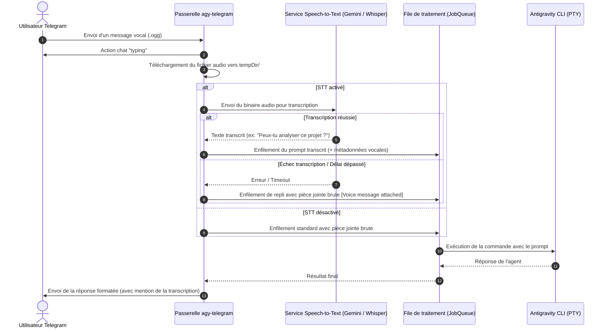

# Spécifications fonctionnelles et techniques : Transcription vocale automatique (Speech-to-Text)

> **Projet :** agy-telegram  
> **Statut :** Spécification validée (prête pour implémentation)  
> **Date de rédaction :** 03/09/2026  
> **Version cible :** v0.5.0  

---

## 1. Contexte et Objectifs

### Problématique actuelle
Actuellement, lorsqu'un utilisateur envoie un message vocal sur Telegram, le bot télécharge le fichier audio (`.ogg`) et transmet uniquement une référence de métadonnées textuelle à l'agent (`[Voice message attached: <chemin> | Duration: Xs]`). L'agent doit donc décider de charger le fichier binaire via ses propres outils multimodaux, ce qui engendre des latences, des coûts de tokens inutiles ou un manque de compréhension immédiate pour les modèles purement textuels.

### Objectifs cibles
1. **Fluidité utilisateur** : Permettre à l'utilisateur de dicter naturellement ses prompts ou requêtes à la voix sans avoir à saisir de texte sur mobile.
2. **Transcription automatique en amont** : Convertir le flux audio en texte brut immédiatement après la réception du message vocal Telegram.
3. **Transmission transparente** : Injecter directement la transcription textuelle comme prompt principal destiné à l'agent Antigravity CLI.
4. **Résilience et repli gracieux** : En cas d'échec ou d'indisponibilité du service de transcription, conserver le fichier audio joint sans bloquer la requête.

---

## 2. Flux fonctionnel détaillé



---

## 3. Modèle de données et Contrats d'interface

### Variables d'environnement requises

```env
# Moteur de transcription : "gemini" (par défaut si clé présente), "whisper-local", ou "none"
STT_PROVIDER=gemini

# Clé d'API pour Gemini Speech (optionnel si GEMINI_API_KEY est déjà configurée)
GEMINI_API_KEY=votre_cle_api_gemini

# Modèle cible pour la transcription (ex: gemini-2.5-flash ou gemini-3.1-flash-lite)
STT_GEMINI_MODEL=gemini-3.1-flash-lite

# Langue cible (ISO 639-1) ou "auto" pour détection automatique
STT_LANGUAGE=auto

# Délai maximum d'attente pour la transcription (en millisecondes)
STT_TIMEOUT_MS=10000
```

### Interfaces TypeScript (`src/domain/stt.ts`)

```typescript
export interface TranscriptionResult {
  text: string;
  detectedLanguage?: string;
  durationSeconds?: number;
  confidence?: number;
}

export interface SttService {
  transcribe(audioFilePath: string, options?: { language?: string; signal?: AbortSignal }): Promise<TranscriptionResult>;
  isAvailable(): boolean;
}
```

---

## 4. Sécurité, Résilience et Gestion des erreurs

1. **Isolation locale et nettoyage temporaire** :
   - Le fichier audio est stocké temporairement dans `tempDir/chat_${chatId}/`.
   - Il est automatiquement purgé après transcription et clôture du tour de dialogue, ou lors de l'exécution de `/new`.
2. **Gestion des délais d'expiration (*timeouts*)** :
   - Tout appel de transcription est borné par `STT_TIMEOUT_MS` (10 s max).
   - En cas d'expiration, le traitement bascule immédiatement sur le mode de repli (fichier joint brut) pour ne pas bloquer l'interaction.
3. **Protection des données et confidentialité** :
   - Aucun fichier audio n'est conservé au-delà de la session active de l'utilisateur.
   - Les clés d'API tierces sont masquées et filtrées avant tout sous-processus.

---

## 5. Expérience utilisateur et Notifications

- **Indicateur visuel** : Dès réception du vocal, le bot affiche l'action `typing` ou `record_voice` sur Telegram.
- **Accusé de transcription dans la réponse** :
  - Si la transcription aboutit, la bulle de confirmation ou l'en-tête de réponse peut inclure un discret indicateur :
    > 🎙️ *« [Transcription] : "Peux-tu refactoriser cette fonction ?" »*
- **Légende combinée** : Si l'utilisateur a joint une légende texte à son message vocal, celle-ci est concaténée proprement :
  `[Transcription vocale] : <texte_transcrit>\n\n[Note] : <légende>`.

---

## 6. Scénarios de tests et Validation

| Identifiant | Scénario de test | Entrée | Résultat attendu |
| :--- | :--- | :--- | :--- |
| **TC-STT-01** | Transcription nominale | Fichier vocal court (5s) en français | Texte correctement extrait et injecté dans `job.prompt`. |
| **TC-STT-02** | Timeout de l'API de transcription | API STT ne répondant pas sous 10s | Bascule gracieuse sur le format brut `[Voice message attached: ...]`. |
| **TC-STT-03** | Audio inaudible / silence | Fichier audio vide ou silence pur | Notification discrète à l'utilisateur et poursuite sans crash. |
| **TC-STT-04** | Vocal avec légende textuelle | Vocal + légende utilisateur | Concaténation harmonieuse du texte transcrit et de la légende. |
| **TC-STT-05** | Purge des fichiers temporaires | Exécution de `/new` après un vocal | Suppression immédiate du fichier `.ogg` sur le disque. |

---

## 7. Plan d'implémentation par étapes

1. **Étape 1 : Couche domaine et adaptateur Gemini Audio**
   - Création de `src/domain/stt.ts` définissant le contrat d'interface.
   - Implémentation du service `GeminiSttService` utilisant l'API REST Gemini avec encodage base64 direct du fichier audio.
2. **Étape 2 : Intégration dans le routeur Telegram**
   - Branchement dans `src/router/updates.ts` lors de la réception de `message.voice`.
   - Exécution asynchrone de la transcription avant constitution du prompt final.
3. **Étape 3 : Tests automatisés de non-régression**
   - Ajout des tests unitaires avec adaptateur simulé (*mock*) dans `test/stt.test.ts`.
   - Vérification du comportement en cas d'échec réseau ou de timeout.
4. **Étape 4 : Documentation et livraison**
   - Mise à jour de `README.md` et de `BACKLOG.md` (statut et lien vers les spécifications).
