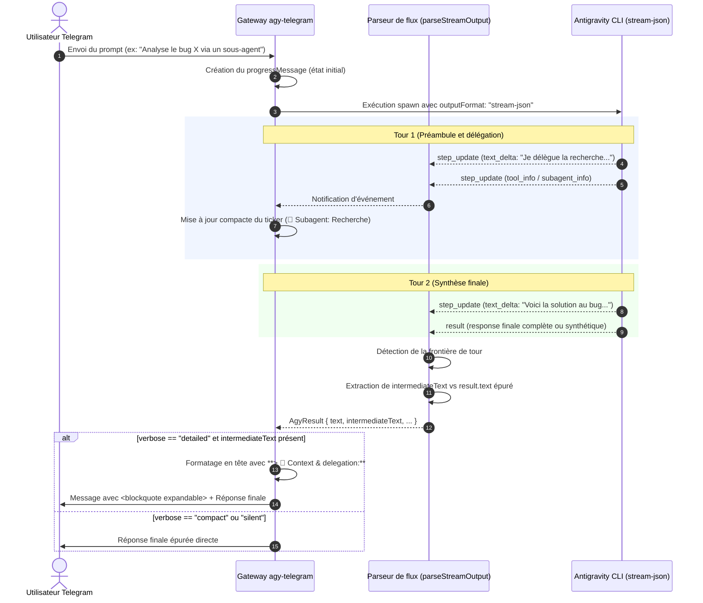

# Spécifications fonctionnelles et techniques : Isolation des tours et citations dépliables Telegram (Option 2.5)

> **Projet :** agy-telegram  
> **Statut :** Implémenté (en cours de qualification fonctionnelle sur bot de test)  
> **Date de rédaction :** 04/09/2026  
> **Version cible :** v0.4.1  
> **Issue associée :** [#29](https://github.com/ardiannurcahya/antigravity-cli-telegram-bot/issues/29)

---

## 1. Contexte et Objectifs

### Problématique actuelle
Lors de l'exécution d'une tâche complexe impliquant des sous-agents ou des appels d'outils successifs, l'agent Antigravity CLI produit souvent un préambule intermédiaire ou une annonce d'intention (ex. *"I will now invoke research subagent to search..."*).
Dans l'implémentation précédente :
1. Ces préambules résiduels demeuraient mélangés à la réponse de synthèse finale dans la bulle de message Telegram, polluant la lisibilité du compte-rendu.
2. Tenter d'injecter l'intégralité du texte intermédiaire dans le message de progression édité en continu (`progressMessage`) provoquait des sauts de mise en page (*layout jumping*) et risquait de déclencher le bridage de débit de l'API Telegram (`429 Too Many Requests`).
3. En cas de configuration `progressMode: delete` ou `compact`, ce contexte intermédiaire disparaissait définitivement une fois le job terminé.

### Solution retenue (Option 2.5)
Validée en concertation avec @sbolten et le mainteneur principal @ardiannurcahya :
1. **Pendant l'exécution :** Maintenir le message de progression léger, fluide et purement télémétrique (compteur de temps, étapes d'outils et sous-agents synthétiques via `formatStepUpdate`).
2. **À la remise finale :**
   - Isoler automatiquement le préambule intermédiaire (`intermediateText`) de la réponse définitive (`result.text`).
   - Lorsque la verbosité est détaillée (`verbose: "detailed"`), formater ce préambule sous forme d'une citation dépliable native Telegram (`<blockquote expandable>...</blockquote>` ou Markdown `**> ...**`) en tête de message.
   - Lorsque la verbosité est réduite (`compact` ou `silent`), omettre le préambule pour ne livrer que la réponse finale propre.

---

## 2. Flux fonctionnel détaillé



---

## 3. Modèle de données et Contrats d'interface

### Extension de l'interface `AgyResult` (`src/types.ts`)
```typescript
export interface AgyResult {
  text: string;
  intermediateText?: string | null;
  parsed: StreamEvent | Record<string, unknown> | null;
  events: StreamEvent[];
  conversationId: string | null;
  model: string | null;
  usage: Usage | null;
  durationMs: number | null;
  numTurns: number | null;
  toolCalls: number;
  status: string | null;
}
```

### Rendu HTML Telegram (`src/telegram/markdown-renderer.ts`)
- Reconnaissance de la syntaxe MarkdownV2 Telegram : `**> texte**` ou `**> ` ligne par ligne.
- Génération de la balise native Telegram : `<blockquote expandable>...</blockquote>`.
- Découpage avec préservation de l'attribut `expandable` dans `splitOversizedHtmlBlock` en cas de message dépassant 4096 caractères.

---

## 4. Sécurité, Résilience et Gestion des erreurs

1. **Échappement strict :** Tous les contenus de préambule insérés dans le bloc dépliable sont échappés via `escapeHtml` / `formatInlineHtml` pour éviter toute injection ou erreur d'analyse d'entités Telegram.
2. **Intégrité en cas d'erreur CLI :** Si le second tour échoue ou est interrompu, `text` conserve le message d'erreur ou le diagnostic AGY sans duplication du préambule.
3. **Zéro surcoût réseau :** Aucun appel API supplémentaire n'est émis (le bloc dépliable fait partie intégrante du message de réponse standard).

---

## 5. Expérience utilisateur et Niveaux de verbosité

Niveau de verbosité (`/verbose`) | Affichage du message de progression | Rendu du message final
:--- | :--- | :---
**detailed** (par défaut) | Ticker compact avec étapes récentes | Bloc dépliable `🤖 Context & delegation` en tête + synthèse
**compact** | Ticker compact avec étapes récentes | Synthèse finale directe (préambule masqué)
**silent** | Aucun ticker en cours | Synthèse finale directe (préambule masqué)

---

## 6. Scénarios de tests et Validation

Scénario | Entrée | Résultat attendu
:--- | :--- | :---
**Délégation multi-tours** | Prompt déclenchant un sous-agent | `intermediateText` isolé, rendu dans `<blockquote expandable>`, réponse propre
**Réponse directe mono-tour** | Prompt factuel simple sans outil | `intermediateText: null`, aucun bloc de citation généré
**Verbosité compacte** | `verbose: "compact"` + multi-tours | Pas de bloc dépliable, livraison directe de `result.text`
**Message long (> 4096 car.)** | Citation dépliable volumineuse | Découpage en plusieurs messages en conservant `<blockquote expandable>`

---

## 7. Plan d'implémentation par étapes

- [x] Extension du modèle de données `AgyResult` dans `src/types.ts`.
- [x] Segmentation des tours et détection des sous-agents dans `src/agy-runner.ts`.
- [x] Support des citations dépliables Telegram dans `src/telegram/markdown-renderer.ts`.
- [x] Intégration conditionnelle selon `verbose` dans `src/usecases/prompt-job.ts`.
- [x] Validation intégrale par la suite de tests unitaires et de non-régression (`npm test`).
- [~] Qualification fonctionnelle interactive sur bot de test dédié (`@Chromie_lemed_test_bot`).
- [ ] Soumission de la pull request vers l'amont (`upstream:main`).
